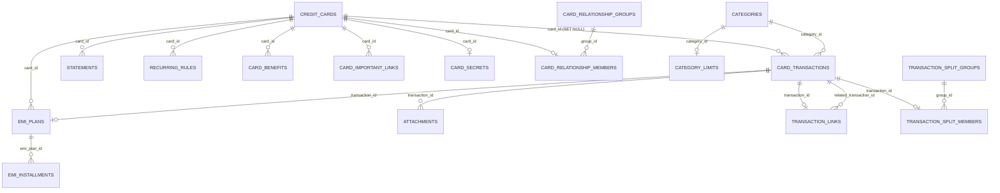

# CardNest SQLite schema and database inspection

This document describes the current CardNest SQLite schema, its relationships, deletion behavior, storage locations, and safe ways to inspect tables during development. The executable source of truth is [`src/app/core/data/migrations.ts`](../src/app/core/data/migrations.ts); update this document whenever a new migration changes the schema.

For platform initialization, WebAssembly setup, and migration architecture, also see [`SQLITE.md`](./SQLITE.md).

## Overview

CardNest uses one logical SQLite database named `cardnest` through `@capacitor-community/sqlite`.

- Android uses the plugin's native SQLite implementation.
- Web uses `sql.js` through `jeep-sqlite`, with the SQLite bytes persisted in IndexedDB.
- `PRAGMA foreign_keys = ON` is enabled after the connection opens.
- `PRAGMA user_version` records the applied migration version.
- Money is stored as integer minor units. For INR, `₹1,500.25` is stored as `150025`.
- Calendar dates use ISO `YYYY-MM-DD`; timestamps use ISO-8601 strings.
- Boolean values are stored as `0` or `1` because SQLite has no separate Boolean storage class.

## Hybrid relational and JSON design

Several core tables contain both normalized columns and a `payload` JSON column.

Normalized columns support constraints, indexes, joins, ordering, and common filters. The JSON payload stores the complete TypeScript domain object so fields can evolve without immediately adding a column for every display-only property.

For example, `card_transactions` stores `amount_minor`, `transaction_date`, `type`, and foreign-key identifiers as columns, while merchant, notes, tax details, split metadata, receipt identifiers, and EMI display metadata are also available in `payload`.

When a domain object changes, persistence code must update both the relevant normalized columns and the JSON payload. Treating only one representation as current can create inconsistent results.

## Entity relationship diagram



`app_preferences` and `monthly_income` are independent records and therefore do not appear in the relationship diagram.

## Table inventory

### Application and planning tables

| Table             | Primary key   | Purpose                                                                                                   | Important fields                                                                                  |
| ----------------- | ------------- | --------------------------------------------------------------------------------------------------------- | ------------------------------------------------------------------------------------------------- |
| `app_preferences` | `key`         | PIN hash, theme, reminder state, budget defaults, profile preferences, and the card-secret encryption key | `encrypted_value` is a generic stored value; the name does not mean every preference is encrypted |
| `monthly_income`  | `period_key`  | Income saved for each budget cycle                                                                        | `cycle_start_date`, `cycle_end_date`, `amount_minor`, `updated_at`                                |
| `categories`      | `id`          | Expense/credit categories and their presentation                                                          | unique case-insensitive `name`, `icon`, `colour`, `applies_to`, `archived`                        |
| `category_limits` | `category_id` | Optional limit for one category                                                                           | `limit_minor`, `show_limit`, `updated_at`                                                         |

### Card tables

| Table                       | Primary key           | Purpose                                                    | Important fields                                                                  |
| --------------------------- | --------------------- | ---------------------------------------------------------- | --------------------------------------------------------------------------------- |
| `credit_cards`              | `id`                  | Credit-card identity and complete serialized card settings | indexed/display fields plus `payload`, `archived`, timestamps                     |
| `card_secrets`              | `card_id`             | Application-encrypted full number and CVV                  | `encrypted_number`, `encrypted_cvv`; values are AES-GCM ciphertext, not plaintext |
| `card_benefits`             | `id`                  | Benefits belonging to a card                               | `card_id`, `name`, `note`, `updated_at`                                           |
| `card_important_links`      | `id`                  | Issuer or support links belonging to a card                | `card_id`, `label`, `url`, `updated_at`                                           |
| `card_relationship_groups`  | `id`                  | Logical group for linked cards sharing an account or limit | `name`, `updated_at`                                                              |
| `card_relationship_members` | `(group_id, card_id)` | Many-to-many joining table for linked-card groups          | `card_id` is unique, so a card belongs to at most one group                       |
| `statements`                | `id`                  | Statement cycle and payment status snapshot                | dates, `card_id`, `payload`                                                       |

### Transaction tables

| Table                       | Primary key                  | Purpose                                                                          | Important fields                                                                                                     |
| --------------------------- | ---------------------------- | -------------------------------------------------------------------------------- | -------------------------------------------------------------------------------------------------------------------- |
| `card_transactions`         | `id`                         | Purchases, payments, refunds, cashback, fees, interest, credits, and adjustments | `card_id`, `category_id`, `type`, `amount_minor`, `currency_code`, `transaction_date`, `payload`, timestamps         |
| `transaction_links`         | `transaction_id`             | Links a refund or adjustment to its original transaction                         | `related_transaction_id`, constrained `relationship_type`, `created_at`                                              |
| `transaction_split_groups`  | `id`                         | Records the total represented by a split transaction                             | `original_amount_minor`, `created_at`                                                                                |
| `transaction_split_members` | `(group_id, transaction_id)` | Associates two to four generated transactions with a split group                 | `transaction_id` is unique                                                                                           |
| `attachments`               | `id`                         | Receipt metadata belonging to a transaction                                      | `transaction_id`, `private_path`, `encrypted_metadata`; image bytes live at the private path rather than in this row |
| `recurring_rules`           | `id`                         | Rules that generate repeated transactions                                        | `card_id`, `next_occurrence_date`, `status`, `payload`                                                               |
| `loan_commitments`          | `id`                         | User-managed external loan and EMI schedules                                     | `status`, `payload`, `updated_at`                                                                                    |

### EMI tables

| Table              | Primary key | Purpose                                                  | Important fields                                                                                 |
| ------------------ | ----------- | -------------------------------------------------------- | ------------------------------------------------------------------------------------------------ |
| `emi_plans`        | `id`        | EMI conversion tied to one original transaction and card | unique `transaction_id`, `card_id`, `status`, `payload`                                          |
| `emi_installments` | `id`        | Individual scheduled installments                        | `emi_plan_id`, `installment_number`, statement/due dates, principal, interest, `paid`, `payload` |

## Payment-source caveat

The current schema has no `payment_sources` table. Cash, Bank/UPI, and meal-card sources are seeded `PaymentSource` objects in `CardNestStore`.

When a transaction uses a non-credit-card source:

- the normalized `card_transactions.card_id` column is stored as `NULL`, because its foreign key can reference only `credit_cards`;
- the full JSON `payload` retains the actual source identifier in `cardId`.

Consequently, SQL queries that must include non-card sources need to inspect `payload` or work through the hydrated application store. A future migration should add a normalized payment-source table and a general source relationship if durable user-defined sources or direct SQL reporting across all source types is required.

## Relationships and delete behavior

SQLite applies the following foreign-key actions:

- Deleting a credit card sets `card_transactions.card_id` to `NULL`, retaining transaction history.
- Deleting a credit card cascades to its statements, recurring rules, EMI plans, benefits, important links, relationship membership, and protected secret row.
- Deleting an EMI plan cascades to all of its installments.
- Deleting a transaction cascades to its attachments, EMI plan, outgoing/incoming transaction links, and split membership.
- Deleting a split group cascades to its membership rows, not the transactions themselves.
- Deleting a linked-card group cascades to membership rows, not the cards themselves.
- Deleting a category cascades to its limit. Transactions referencing the category restrict deletion unless those transactions are reassigned or removed first because `card_transactions.category_id` has no cascading delete action.

The user-facing card deletion flow currently uses soft deletion (`deletedAt` in the card payload) so the application can continue showing the source identity in historical views. Physical SQL deletion and soft deletion are different operations.

## Indexes and constraints

Current indexes are:

| Index                            | Columns                                         | Use                                                             |
| -------------------------------- | ----------------------------------------------- | --------------------------------------------------------------- |
| `idx_transactions_card_date`     | `card_id`, `transaction_date`                   | Card activity ordered or filtered by date                       |
| `idx_transactions_category`      | `category_id`                                   | Category-spending queries                                       |
| `idx_statements_card_cycle`      | `card_id`, `cycle_start_date`, `cycle_end_date` | Statement lookup                                                |
| `idx_recurring_next`             | `status`, `next_occurrence_date`                | Due recurring-rule generation                                   |
| `idx_emi_card_status`            | `card_id`, `status`                             | Active EMI plans by card                                        |
| `idx_emi_due`                    | `due_date`, `paid`                              | Upcoming unpaid installments                                    |
| `idx_monthly_income_cycle_start` | `cycle_start_date DESC`                         | Income history                                                  |
| `idx_card_benefits_name`         | `name COLLATE NOCASE`                           | Case-insensitive benefit lookup                                 |
| `idx_transaction_links_related`  | `related_transaction_id`                        | Reverse lookup from original transaction to adjustments/refunds |

Notable constraints include non-negative money values, unique category names, one EMI plan per original transaction, one installment number per plan, one linked-card group per card, and transaction-link types limited to `REFUND` or `ADJUSTMENT`.

## Migrations

Migrations are append-only and execute in increasing version order. Never rewrite an old migration after it may have reached a user's device. Instead:

1. Add a new entry with the next integer version in `migrations.ts`.
2. Use `CREATE TABLE IF NOT EXISTS`, `ALTER TABLE`, or data-copy statements appropriate to the change.
3. Update loading, persistence, deletion, backup, and domain mapping code.
4. Add the table to `BACKUP_TABLES` and `DELETE_TABLES` in `sqlite-database.ts` when applicable.
5. Update this schema document.
6. Test both a fresh database and an upgrade from the previous version.

Useful version checks:

```sql
PRAGMA user_version;
PRAGMA foreign_keys;
PRAGMA integrity_check;
PRAGMA foreign_key_check;
```

## Viewing Android tables and data

### Android Studio Database Inspector

This is the easiest option for a debug build:

1. Install and run the debug APK on an emulator or connected device.
2. In Android Studio, open **View > Tool Windows > App Inspection**.
3. Select the CardNest process and open **Database Inspector**.
4. Expand the `cardnest`/`cardnestSQLite.db` database to browse tables.
5. Double-click a table to view rows or open a query tab to run read-only SQL.

Database Inspector works only while a debuggable process is available. Pause live updates before attempting schema-changing statements; normal inspection should remain read-only.

### Copying a debug database with ADB

First find the exact private database filename:

```powershell
adb shell run-as com.actionanand.cardnest.app ls -la databases
```

The Capacitor plugin commonly names it `cardnestSQLite.db`. For a debuggable application, copy it to the current directory with:

```powershell
adb exec-out run-as com.actionanand.cardnest.app cat databases/cardnestSQLite.db > cardnestSQLite.db
```

Then open the copied file with the `sqlite3` command-line tool, DB Browser for SQLite, or another desktop SQLite viewer. Copy any accompanying `-wal` and `-shm` files or close the app/checkpoint the database first if the latest writes are not visible.

`run-as` normally cannot access a production release build. Do not weaken release security merely to inspect the database.

## Viewing the web database

For a standalone explanation of IndexedDB, the CardNest web storage stack, DevTools navigation, live SQL querying, payload inspection, troubleshooting, and safety rules, see [`WEB_SQLITE_INDEXEDDB_INSPECTION.md`](./WEB_SQLITE_INDEXEDDB_INSPECTION.md).

Open browser developer tools and go to **Application > IndexedDB**. CardNest data is stored under the `jeepSQLiteStore` IndexedDB database. This confirms that the serialized SQLite database exists and changes are being persisted.

IndexedDB shows the stored SQLite representation, not convenient relational rows. However, while CardNest is open, the `<jeep-sqlite>` element exposes the same live SQLite query API used by the Capacitor web plugin. You can run `SELECT` and `PRAGMA` statements directly from the browser console without adding an inspector page.

### Querying the live database from DevTools

1. Run CardNest in a browser and wait until the application has finished loading. The page must not show the “SQLite storage is unavailable” warning.
2. Open browser developer tools and select the **Console** tab.
3. Obtain the existing `jeep-sqlite` element and confirm that CardNest's read/write connection is open:

   ```js
   var cardNestSqlite = document.querySelector('jeep-sqlite');
   await cardNestSqlite.isDBOpen({ database: 'cardnest', readonly: false });
   ```

   A successful result is `{ result: true }`.

4. Create a small console-only helper around the element's `query()` method:

   ```js
   globalThis.cardNestQuery = async (statement, values = []) => {
     const result = await cardNestSqlite.query({
       database: 'cardnest',
       statement,
       values,
       readonly: false,
     });
     return result.values ?? [];
   };
   ```

5. Run a query and display its rows:

   ```js
   console.table(
     await cardNestQuery(`
       SELECT transaction_date, type, amount_minor, category_id
       FROM card_transactions
       ORDER BY transaction_date DESC, created_at DESC
       LIMIT 50
     `),
   );
   ```

The `readonly: false` option is important even for a `SELECT`. CardNest creates and retains a read/write connection named `RW_cardnest`; asking `jeep-sqlite` for a separate read-only connection produces `No available connection for cardnest`. The SQL statement itself should remain read-only during inspection.

### Listing tables and columns from the console

The element has a table-list method:

```js
console.table(
  (
    await cardNestSqlite.getTableList({
      database: 'cardnest',
      readonly: false,
    })
  ).values,
);
```

You can also use normal SQLite metadata queries:

```js
console.table(
  await cardNestQuery(`
    SELECT name, sql
    FROM sqlite_master
    WHERE type = 'table' AND name NOT LIKE 'sqlite_%'
    ORDER BY name
  `),
);

console.table(await cardNestQuery('PRAGMA table_info(card_transactions)'));
console.table(await cardNestQuery('PRAGMA foreign_key_list(card_transactions)'));
```

### Inspecting JSON payload fields

Tables such as `credit_cards`, `card_transactions`, `emi_plans`, and `emi_installments` contain a `payload` JSON string. Parse it in the console when you need fields that are not normalized columns:

```js
var transactionRows = await cardNestQuery(`
  SELECT id, transaction_date, payload
  FROM card_transactions
  ORDER BY transaction_date DESC
  LIMIT 20
`);

console.table(
  transactionRows.map(({ payload, ...row }) => ({
    ...row,
    ...JSON.parse(payload),
  })),
);
```

The helper and variables above exist only in the current DevTools page session. Reloading or closing the tab removes them.

### Troubleshooting console queries

- If `document.querySelector('jeep-sqlite')` returns `null`, confirm you are running the web build and that the page finished loading.
- If `isDBOpen()` returns `false`, reload CardNest and resolve any startup-storage error before querying.
- If the console reports `No available connection for cardnest`, ensure every call uses `database: 'cardnest'` and `readonly: false` and do not call `createConnection()` or `open()` yourself.
- If a query reports `no such table`, check `PRAGMA user_version` and application startup errors; a migration may not have completed.
- If recently changed rows are missing from IndexedDB but visible through SQL, wait for the write/save operation to finish or reload after `saveToStore()` completes.

Do not call `run()`, `execute()`, `deleteDatabase()`, `importFromJson()`, or other mutating methods from DevTools. The running Angular store would not automatically reconcile arbitrary console writes, and a malformed change can corrupt relationships or overwrite browser data.

For repeatable development inspection, alternatives are:

1. Add a temporary development-only page or test that injects `SqliteDatabase` and calls `query()`.
2. Export a development snapshot through a purpose-built unencrypted developer utility, then open the resulting SQLite file or JSON outside the app.
3. Reproduce the data in an Android debug build and use Database Inspector when platform parity is sufficient.

Example development query:

```ts
const rows = await database.query<Record<string, unknown>>(
  `SELECT id, transaction_date, type, amount_minor, category_id
   FROM card_transactions
   ORDER BY transaction_date DESC
   LIMIT 100`,
);
console.table(rows);
```

Do not permanently expose `SqliteDatabase` on `window`, ship a general SQL console, or leave row logging enabled in production. Card payloads and preference rows can contain private information or encrypted secret material.

## Useful inspection queries

```sql
-- List user tables.
SELECT name
FROM sqlite_master
WHERE type = 'table' AND name NOT LIKE 'sqlite_%'
ORDER BY name;

-- Show every relationship declared by a table.
PRAGMA foreign_key_list(card_transactions);

-- Count records in the main areas.
SELECT 'cards' AS area, COUNT(*) AS records FROM credit_cards
UNION ALL SELECT 'transactions', COUNT(*) FROM card_transactions
UNION ALL SELECT 'categories', COUNT(*) FROM categories
UNION ALL SELECT 'emi_plans', COUNT(*) FROM emi_plans;

-- Recent transactions with card and category display names.
SELECT
  t.transaction_date,
  t.type,
  t.amount_minor,
  c.nickname AS card,
  category.name AS category
FROM card_transactions AS t
LEFT JOIN credit_cards AS c ON c.id = t.card_id
JOIN categories AS category ON category.id = t.category_id
ORDER BY t.transaction_date DESC, t.created_at DESC
LIMIT 100;

-- Both directions of refund/adjustment links.
SELECT
  link.relationship_type,
  link.transaction_id,
  link.related_transaction_id,
  child.amount_minor AS linked_amount,
  original.amount_minor AS original_amount
FROM transaction_links AS link
JOIN card_transactions AS child ON child.id = link.transaction_id
JOIN card_transactions AS original ON original.id = link.related_transaction_id;

-- EMI schedule with plan status.
SELECT
  plan.id AS plan_id,
  plan.status,
  installment.installment_number,
  installment.due_date,
  installment.principal_minor,
  installment.interest_minor,
  installment.paid
FROM emi_plans AS plan
JOIN emi_installments AS installment ON installment.emi_plan_id = plan.id
ORDER BY plan.id, installment.installment_number;
```

SQLite with the JSON1 extension can inspect payload fields:

```sql
SELECT
  id,
  json_extract(payload, '$.merchant') AS merchant,
  json_extract(payload, '$.cardId') AS application_source_id,
  json_extract(payload, '$.taxMinor') AS tax_minor
FROM card_transactions
ORDER BY transaction_date DESC;
```

JSON1 availability depends on the SQLite engine build. Normal application code should prefer normalized columns and typed payload parsing rather than relying on JSON SQL functions across platforms.

## Backup files are not SQLite files

The `.cnbak` extension identifies an encrypted CardNest backup. It contains an AES-GCM encrypted database export protected by a PBKDF2-derived key. Depending on platform/version, the decrypted content is a Capacitor SQLite JSON export or CardNest's portable table JSON format.

Renaming a `.cnbak` file to `.db` will not make it readable by SQLite tools. Use CardNest Restore with the correct passphrase. A separate, explicitly development-only conversion utility would be required for external inspection.

## Security notes

- The SQLite file currently uses plugin mode `no-encryption`; sensitive full numbers and CVVs are encrypted at the application field level before storage.
- `card_secrets` and encrypted values embedded in `credit_cards.payload` are ciphertext, but should still be handled as sensitive data.
- The card-secret master key is stored in `app_preferences`; copying both it and ciphertext increases exposure and must be avoided outside controlled debugging.
- Never publish database copies, screenshots containing personal transactions, decrypted backups, or console output from a real account.
- Prefer synthetic development data when inspecting or sharing a database.
